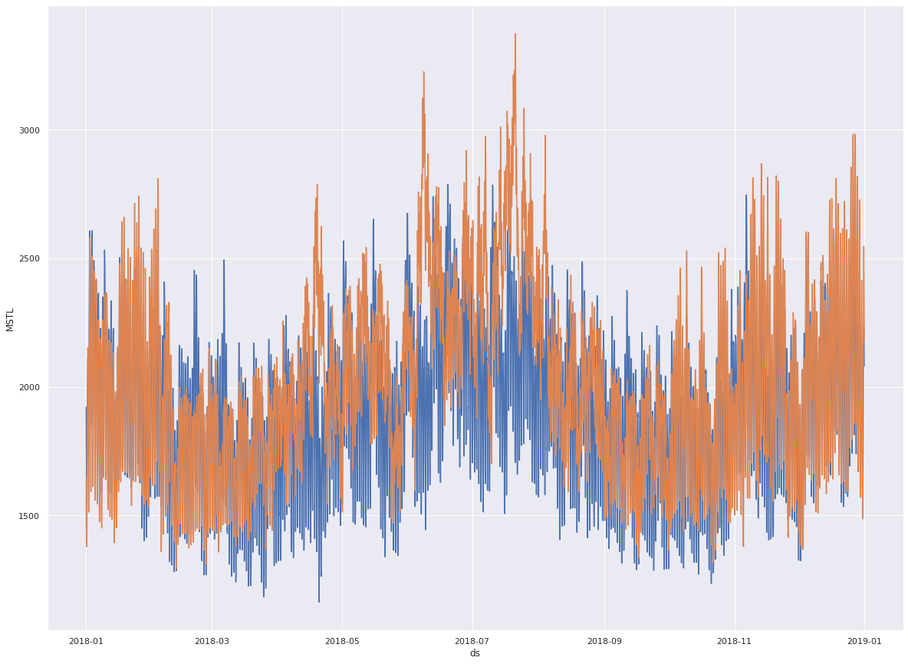

# Energy demand forecasting 

Electrical energy demand is captuted from 2008 to 2018 for every hour.
Forcesting of future demand helps to plan and allocate funds for the infrastructure.

Train data was a part of analytics vidhya hacathon competition, placed here in the master folder.

Different methods are explored to train the model for forecasting.
1) Extracting the hour, month, day of the year as featurizers and
2) Nixtala stats forecasts package is used.
   2.1) AutoArima
   2.2) MSTL
   2.3) AutoArimaPhrophet
   
All algoriths predicts the initial energy demands with less error.
However, all the methods differ slightly in predicting the energy demand for the entire year. 

During the compition energy demand for 2019 was considered as test set.
As as the actual values are not available for the test set, here I have taken the
year 2018 as the test set to chech the accurasy of forecasting. 

# 

Figure. seasonal decompose capturing trend 

# 

Figure. Comparision of forecast and actual energy demand

